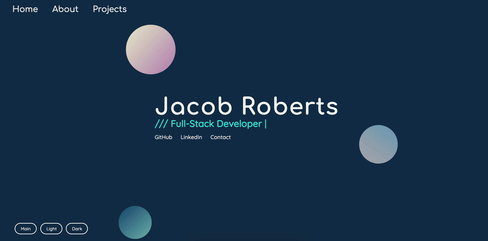

# Portfolio Website

The first version of my portfolio website. The site functions as a single-page application with dynamically-loaded content, animations, and three different theme options.

🔗 **Live site:** [here](https://www.jacobroberts.dev)

## Built Using

- HTML
- CSS
- Javascript
- VSCode
- Git
- Google fonts

## Author

👤 **Jacob Roberts**

- GitHub: [Jacobrobertsdev](https://github.com/jacobrobertsdev)
